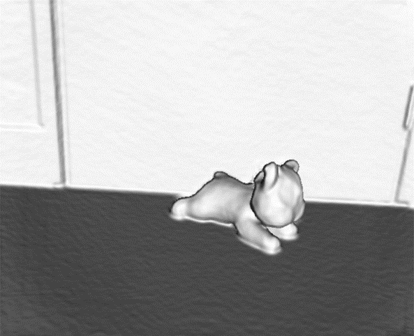

# 基于深度相机的三维重建

通过kinect相机获取深度数据进行处实现三维重建
## 简介
参考了**kinfu**，用cmake编译**pcl**（点云库），kinectfusion的开源实现
三维重建过程利用深度图像进行处理，生成点云模型提取坐标及法向量，
利用ICP算法（迭代最近点算法）进行图像的配准，计算相机的位姿，
再通过tsdf截断符号距离函数算法将配准得到的数据融合，并且生成模型表面。
在计算运行过程中利用GPU并行运算进行加速，从而提高算法运行速率，可以实现实时三维重建。

## 环境配置，工具准备
kinect，vs2010 x64，cmake 3.5.0，CUDA5.0或更高，OPENNI1.5.4，sensorkinect  
第三方库（这里提供一套可成功运行的版本及其下载链接）  
[Boost-1.49.0](http://sourceforge.net/projects/pointclouds/files/dependencies/Boost-1.49.0-vs2010-x64.exe/download)  
[qhull-6.2.0.1385](http://sourceforge.net/projects/pointclouds/files/dependencies/qhull-6.2.0.1385-vs2010-x64.exe/download)  
[VTK-5.8.0](http://sourceforge.net/projects/pointclouds/files/dependencies/VTK-5.8.0-msvc2010-win64_with_qt_support.exe/download)  
[Qt_4.8.0](http://sourceforge.net/projects/pointclouds/files/dependencies/Qt_4.8.0_msvc2010_win64.exe/download)  
[flann-1.7.1](http://sourceforge.net/projects/pointclouds/files/dependencies/flann-1.7.1-vs2010-x64.exe/download0)  
[Eigen-3.0.5](http://sourceforge.net/projects/pointclouds/files/dependencies/Eigen-3.0.5.exe/download)  
含有kinectfusion的pcl源码：https://github.com/yataozhong/pcl.git/  
## cmake编译配置pcl
参考链接： http://pointclouds.org/documentation/tutorials/compiling_pcl_windows.php#compiling-pcl-windows  
## 注意事项
1. 安装openni作为kinect的数据获取，则不能使用官方的SDK，安装时不能接入kinect。  
2. 建议第三方库安装时选择默认路径。

## 三维重建过程总结
a.通过深度相机获取一帧深度数据；
b.通过深度图像生成点云数据，计算坐标和法向量；
c.通过ICP算法将这帧点云数据与现有的点云模型进行配准，计算变换矩阵，计算相机位姿；
d.根据计算出的相机位姿，利用TSDF点云融合算法将当前点云融合到现有点云模型中；
f.使用光线投影算法，计算出当前视角下的点云模型，修正原点云，参与c中的下一帧匹配；
d.对融合的点云进行渲染，重建出三维场景。

##结果展示

 
